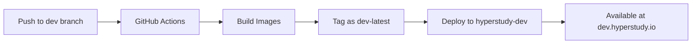

# Development Environment

## Overview

HyperStudy uses a dedicated development environment that mirrors the production architecture but with reduced resources. This allows developers to test features, including horizontal scaling, without affecting production systems.

## Architecture

The development environment runs in a separate Kubernetes namespace (`hyperstudy-dev`) with its own:
- LoadBalancer (Traefik)
- Domain (dev.hyperstudy.io)
- Docker images (tagged as `dev-latest`)
- Scaled-down resources

### Resource Allocation

| Component | Production | Development | Purpose |
|-----------|------------|-------------|---------|
| Backend Pods | 3 | 2 | Test horizontal scaling with minimal resources |
| Frontend Pods | 3 | 1 | Single instance sufficient for dev |
| Pod-Router | 2 | 1 | Basic routing functionality |
| Redis | 1 | 1 | State management |
| Traefik | 2 | 1 | Ingress controller |

## Deployment Workflow

### Automatic Deployments

The development environment uses GitHub Actions for continuous deployment:

1. **Push to `dev` branch** → Triggers deployment to development
2. **Push to `main` branch** → Triggers deployment to production



### Manual Deployment

To manually trigger a deployment:

```bash
# From GitHub UI
1. Go to Actions → Deploy Application
2. Click "Run workflow"
3. Select branch: dev
4. Select environment: development
5. Click "Run workflow"
```

## Working with the Dev Environment

### Switching Between Branches

```bash
# Switch to dev branch
git checkout dev

# Make changes
git add .
git commit -m "Your changes"
git push origin dev  # Triggers deployment

# Switch back to main
git checkout main
```

### Checking Deployment Status

```bash
# View GitHub Actions status
gh run list --workflow=deploy-application.yml --limit 5

# Check dev namespace resources
kubectl get all -n hyperstudy-dev

# View pod logs
kubectl logs -n hyperstudy-dev deployment/backend

# Check pod-router logs
kubectl logs -n hyperstudy-dev deployment/pod-router
```

### Testing Horizontal Scaling

The dev environment has 2 backend pods, allowing you to test:
- Room-to-pod assignment
- Participant routing
- Cross-pod communication
- Load distribution

```bash
# Scale backend pods (temporarily)
kubectl scale statefulset backend -n hyperstudy-dev --replicas=3

# Check room assignments
kubectl exec -n hyperstudy-dev redis-0 -- redis-cli KEYS "room:*:pod"

# Monitor pod distribution
for i in 0 1; do
  echo "=== backend-$i ==="
  kubectl logs backend-$i -n hyperstudy-dev --tail=10
done
```

## Environment Variables

### Development-Specific Settings

The dev environment automatically applies these configurations:

```yaml
NODE_ENV: development
ENVIRONMENT: development
LOG_LEVEL: debug
CORS_ORIGIN: https://dev.hyperstudy.io
DISABLE_RATE_LIMITING: true
MAX_ROOMS_PER_POD: 5      # Reduced from 20
MAX_PARTICIPANTS_PER_POD: 20  # Reduced from 80
```

### Firebase Configuration

Development uses the same Firebase project as production. Be careful when testing:
- Use test accounts prefixed with `dev_`
- Create test experiments with clear naming
- Clean up test data regularly

## Accessing Services

### Public URLs

- **Application**: https://dev.hyperstudy.io
- **API**: https://dev.hyperstudy.io/api
- **Socket.IO**: wss://dev.hyperstudy.io/socket.io

### Internal Services

```bash
# Port-forward to access internal services
kubectl port-forward -n hyperstudy-dev svc/traefik-dashboard 8080:8080
# Access at http://localhost:8080

# Redis CLI
kubectl exec -it -n hyperstudy-dev redis-0 -- redis-cli

# Backend health check
kubectl exec -n hyperstudy-dev backend-0 -- curl localhost:3000/health
```

## Debugging Tools

### Debug Logger

The frontend includes a built-in debug logger (`debugLogger.js`) that provides an on-screen debug panel and persistent logging. This tool works even when `console.log` statements are stripped during the build process.

#### Features

- **Visible Debug Panel**: Shows logs in an on-screen overlay
- **localStorage Persistence**: Logs survive page refreshes
- **Export Capability**: Download logs as JSON for analysis
- **Automatic in Development**: Shows automatically when running in development mode

#### Usage

Import the debug logger in your component:

```javascript
import debugLogger from '$lib/utils/debugLogger.js';

// Log a simple message
debugLogger.log('ComponentName', 'Something happened');

// Log with data
debugLogger.log('ComponentName', 'Config updated', { newConfig });

// Log complex objects
debugLogger.log('SparseRating', 'Video config changed', {
  videoId: selectedVideoId,
  distribution: videoConfig.distribution
});
```

#### Keyboard Shortcuts

- **Ctrl+Shift+D**: Toggle debug panel visibility
- The panel shows the last 20 log entries
- Logs are automatically saved to localStorage

#### Viewing Logs

1. **On-Screen Panel**
   - Appears at bottom-right of browser window
   - Black background with green text (terminal style)
   - Auto-scrolls to show latest entries
   - Click "Clear" button to reset logs

2. **Browser Console**
   - Logs are also sent to `console.log` when available
   - Open DevTools (F12) to view console logs

3. **Export Logs**
   ```javascript
   // Export logs programmatically
   debugLogger.exportLogs(); // Downloads JSON file

   // Get logs array
   const logs = debugLogger.getLogs();
   console.log(logs);
   ```

#### Example: Debugging Sparse Rating Autosave

```javascript
// In SparseRatingConfigEditor.svelte
import debugLogger from '$lib/utils/debugLogger.js';

function updateVideoConfig(videoId, path, value, immediate) {
  debugLogger.log('SparseRating', `Updating ${path}`, { videoId, value });

  const currentVideoConfig = getOrCreateVideoConfig(videoId, selectedStateId);
  const updatedVideoConfig = setNestedValue(currentVideoConfig, path, value);

  debugLogger.log('SparseRating', 'Updated config created', updatedVideoConfig);

  const newConfig = createConfigUpdate(videoId, updatedVideoConfig);

  if (immediate || !shouldDebounce(path)) {
    debugLogger.log('SparseRating', 'Immediate save', newConfig);
    updater.updateImmediate(newConfig);
  } else {
    debugLogger.log('SparseRating', 'Debounced save', newConfig);
    updater.updateDebounced(newConfig, path);
  }
}
```

#### Browser DevTools Console

If console logs are not appearing in the browser console after rebuilding the Docker image, check:

1. **Vite Configuration**: Ensure `mode === 'production'` check in `vite.config.js`
   ```javascript
   terserOptions: {
     compress: {
       drop_console: mode === 'production',  // Only strip in production
       drop_debugger: mode === 'production'
     }
   }
   ```

2. **Rebuild Frontend Image**: After changing Vite config
   ```bash
   # Trigger rebuild via GitHub Actions
   gh workflow run "Deploy Application" --ref dev

   # Or manually rebuild
   kubectl rollout restart deployment/frontend -n hyperstudy-dev
   ```

3. **Check Browser Console Settings**:
   - Open DevTools (F12)
   - Go to Console tab
   - Ensure log levels are enabled (Info, Debug, etc.)
   - Clear "Hide network" and other filters

#### Debugging Tips

1. **Component Hierarchy**: Use consistent component names
   ```javascript
   debugLogger.log('ComponentName', message, data);
   // Examples: 'SparseRating', 'ComponentConfigPanel', 'GlobalComponentConfigurator'
   ```

2. **Update Chain**: Log at each level to trace data flow
   ```javascript
   // Child component
   debugLogger.log('Child', 'Sending update to parent', newData);

   // Parent component
   debugLogger.log('Parent', 'Received update from child', newData);
   ```

3. **Reactivity Issues**: Log before/after derived state changes
   ```javascript
   debugLogger.log('Component', 'Before derived update', { oldState });
   // ... state change ...
   debugLogger.log('Component', 'After derived update', { newState });
   ```

4. **Autosave Flow**: Trace the complete save chain
   ```javascript
   // Level 1: Child editor
   debugLogger.log('Editor', 'Config changed', config);

   // Level 2: Config panel
   debugLogger.log('ConfigPanel', 'Forwarding to parent', config);

   // Level 3: Configurator
   debugLogger.log('Configurator', 'Saving to backend', config);
   ```

## Troubleshooting

### Common Issues

#### Deployment Not Triggering
- Ensure you're pushing to the `dev` branch
- Check GitHub Actions is enabled for the repository
- Verify secrets are configured in GitHub

#### Pods Not Starting
```bash
# Check pod status
kubectl get pods -n hyperstudy-dev

# Describe pod for events
kubectl describe pod <pod-name> -n hyperstudy-dev

# Check logs
kubectl logs <pod-name> -n hyperstudy-dev
```

#### DNS Not Resolving
- Verify Cloudflare DNS points to: `159.203.149.180`
- Check IngressRoute configuration:
```bash
kubectl get ingressroute -n hyperstudy-dev
```

#### Images Not Found
```bash
# Check if images exist
doctl registry repository list-tags backend | grep dev-latest
doctl registry repository list-tags frontend | grep dev-latest

# Manually build and push if needed
docker build -t registry.digitalocean.com/hyperstudy/backend:dev-latest ./backend
docker push registry.digitalocean.com/hyperstudy/backend:dev-latest
```

## Monitoring

### Resource Usage

```bash
# Check resource consumption
kubectl top pods -n hyperstudy-dev

# View HPA status (if configured)
kubectl get hpa -n hyperstudy-dev
```

### Logs Aggregation

```bash
# Stream all backend logs
kubectl logs -n hyperstudy-dev -l app=backend -f

# Stream pod-router logs
kubectl logs -n hyperstudy-dev deployment/pod-router -f
```

## Cleanup

### Temporary Scaling Down

```bash
# Scale down when not in use
kubectl scale deployment frontend -n hyperstudy-dev --replicas=0
kubectl scale statefulset backend -n hyperstudy-dev --replicas=0
kubectl scale deployment pod-router -n hyperstudy-dev --replicas=0
```

### Complete Removal

```bash
# Delete all resources in dev namespace
kubectl delete all --all -n hyperstudy-dev

# Delete the namespace (removes everything)
kubectl delete namespace hyperstudy-dev
```

## Best Practices

1. **Branch Management**
   - Keep `dev` branch close to `main`
   - Regularly merge `main` into `dev`
   - Test features in `dev` before merging to `main`

2. **Data Isolation**
   - Use test accounts for development
   - Prefix test data with `dev_` or `test_`
   - Don't use production user accounts

3. **Resource Management**
   - Scale down when not actively developing
   - Monitor resource usage to avoid waste
   - Clean up old test data regularly

4. **Testing**
   - Test horizontal scaling with 2+ pods
   - Verify room assignments work correctly
   - Test failover scenarios

## Configuration Files

The development environment configuration is located in:

```
k8s/environments/dev/
├── namespace.yaml           # Namespace definition
├── kustomization.yaml       # Kustomize configuration
├── scaling-patches.yaml    # Resource scaling
├── config-patches.yaml     # Environment variables
├── traefik-dev.yaml        # Traefik LoadBalancer
└── ingress-dev.yaml        # IngressRoute for dev.hyperstudy.io
```

## CI/CD Pipeline

The GitHub Actions workflow (`deploy-application.yml`) automatically:

1. Detects the branch (`dev` or `main`)
2. Sets appropriate environment variables
3. Builds Docker images with correct tags
4. Deploys to the correct namespace
5. Verifies deployment health

### Environment Detection

```yaml
if [[ "${{ github.ref }}" == "refs/heads/dev" ]]; then
  ENVIRONMENT="development"
  NAMESPACE="hyperstudy-dev"
  IMAGE_TAG="dev-latest"
else
  ENVIRONMENT="production"
  NAMESPACE="hyperstudy"
  IMAGE_TAG="latest"
fi
```

## Related Documentation

- [Horizontal Scaling Architecture](./architecture/horizontal-scaling.md)
- [Deployment Guide](./deployment.md)
- [Kubernetes Setup](../administrators/kubernetes-setup.md)
- [GitHub Actions](./ci-cd.md)