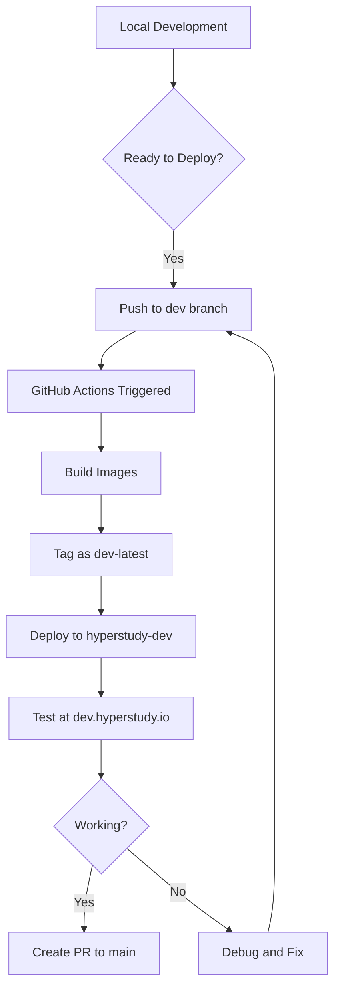

# Developer Quick Start Guide

## Prerequisites

- Git access to the HyperStudy repository
- Docker installed locally (optional for local builds)
- `kubectl` configured with cluster access
- `gh` CLI tool (for checking deployments)

## Getting Started

### 1. Clone and Setup

```bash
# Clone the repository
git clone https://github.com/ljchang/hyperstudy.git
cd hyperstudy

# Switch to dev branch
git checkout dev

# Install dependencies (optional for local development)
cd backend && npm install
cd ../frontend && npm install
```

### 2. Making Changes

```bash
# Make your changes
edit backend/src/your-file.js

# Test locally (optional)
cd backend && npm run dev
cd frontend && npm run dev

# Commit and push to trigger deployment
git add .
git commit -m "Add new feature"
git push origin dev
```

### 3. Monitor Deployment

```bash
# Watch GitHub Actions
gh run watch

# Or check status
gh run list --workflow=deploy-application.yml --limit 1

# Monitor pods
kubectl get pods -n hyperstudy-dev -w
```

### 4. Access Development Site

Once deployed, access your changes at:
- **Web**: https://dev.hyperstudy.io
- **API**: https://dev.hyperstudy.io/api

## Common Development Tasks

### Testing Horizontal Scaling

```bash
# Create a test experiment with multiple participants
# The 2 backend pods will handle room assignments

# Check which pod handles which room
kubectl exec -n hyperstudy-dev redis-0 -- redis-cli GET "room:ROOM_ID:pod"
```

### Debugging Issues

```bash
# View backend logs
kubectl logs -n hyperstudy-dev backend-0 -f

# View pod-router logs (routing decisions)
kubectl logs -n hyperstudy-dev deployment/pod-router -f

# Check Socket.IO connections
kubectl logs -n hyperstudy-dev backend-0 | grep -i socket
```

### Local Development with Remote Backend

```bash
# Port-forward to dev backend
kubectl port-forward -n hyperstudy-dev service/backend-service 3000:3000

# Run frontend locally pointing to dev backend
cd frontend
VITE_BACKEND_URL=http://localhost:3000 npm run dev
```

## Deployment Flow



## Environment Comparison

| Aspect | Development | Production |
|--------|------------|------------|
| **Branch** | `dev` | `main` |
| **Namespace** | `hyperstudy-dev` | `hyperstudy` |
| **URL** | dev.hyperstudy.io | hyperstudy.io |
| **Image Tag** | `dev-latest` | `latest` |
| **Backend Pods** | 2 | 3 |
| **Auto-deploy** | On push to dev | On push to main |
| **Rate Limiting** | Disabled | Enabled |
| **Log Level** | Debug | Info |

## Tips

1. **Always work on dev branch** for new features
2. **Test horizontal scaling** with at least 2 participants
3. **Monitor pod-router logs** to understand routing decisions
4. **Use descriptive commit messages** for easier debugging
5. **Clean up test data** after testing

## Getting Help

- Check logs: `kubectl logs -n hyperstudy-dev <pod-name>`
- Describe resources: `kubectl describe pod <pod-name> -n hyperstudy-dev`
- View events: `kubectl get events -n hyperstudy-dev`
- Check GitHub Actions: https://github.com/ljchang/hyperstudy/actions